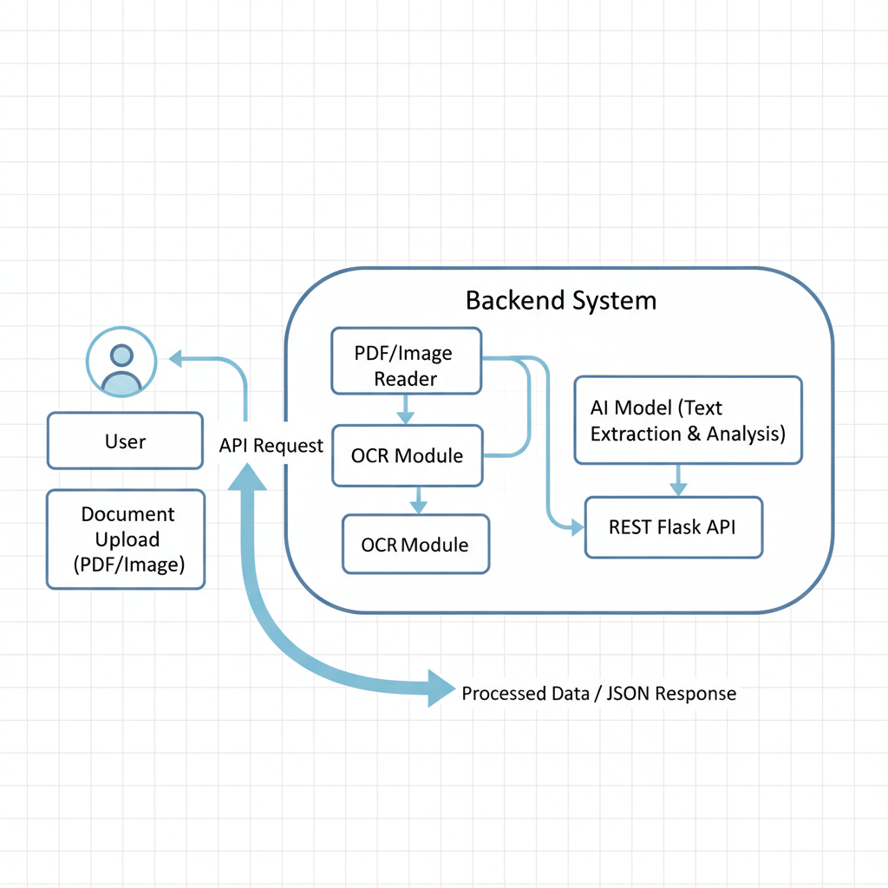

-----------------------------------------------------------------------------------------------------------------------------------------------------------------------------

# 🚀 NEO – AI-Powered Document & Multimedia Assistant

**NEO** is an **end-to-end AI assistant** built with Flask that converts documents, images, and multimedia queries into **intelligent, interactive knowledge responses**. It integrates **OCR (Google Vision + Tesseract)**, **Vertex AI (Gemini 1.5)**, and multiple APIs (Spotify, YouTube, Wikipedia, Weather) to provide **context-aware answers, summaries, and actionable tasks**.

-----------------------------------------------------------------------------------------------------------------------------------------------------------------------------
## 📌 Key Features

* 📂 Upload & process **PDFs, DOCX, TXT, PNG, JPG, JPEG**
* 🔍 OCR via **Google Vision API** & **Tesseract** for scanned documents/images
* ⚡ **Multithreaded ingestion** + **caching** for fast processing
* 🤖 AI-powered **summarization & Q\&A** using **Vertex AI Gemini 1.5**
* 🌐 Integration with external services:

  * **Wikipedia** search & summaries
  * **Google Search**
  * **Spotify playback**
  * **YouTube video playback**
  * **Weather information**
* 🧩 Modular architecture – easy to extend with new AI models or endpoints
* 🎙 Optional **Text-to-Speech** via pyttsx3 (disabled on Render)

-----------------------------------------------------------------------------------------------------------------------------------------------------------------------------

## 🏗️ System Architecture & Workflow

### 1️⃣ User Upload

* Users upload documents/images through the web UI.
* Files are validated against allowed types and stored in `uploads/`.

### 2️⃣ Document Ingestion & Preprocessing

* **Text files** (`txt`, `docx`, machine-readable PDFs) → Read directly.
* **Scanned PDFs/images** → OCR with Google Vision API + Tesseract.
* Supports **multithreading** to cache content without blocking.

### 3️⃣ AI Querying

* Uploaded documents’ content is cached.
* User queries are combined with cached context and sent to **Vertex AI (Gemini 1.5)**.
* Responses include answers, summaries, and actionable instructions.

### 4️⃣ Multimedia & Knowledge Integrations

* **Spotify:** Play requested tracks on available devices.
* **YouTube:** Open video links in browser.
* **Wikipedia/Google:** Search & retrieve relevant content.
* **Weather API:** Current weather info per location.

-----------------------------------------------------------------------------------------------------------------------------------------------------------------------------

## 🔀 Data Flow

```
User → Upload → Backend → Preprocessing/OCR → Caching
       ↘ AI Model (Vertex AI) → Q&A/Summarization → User
       ↘ API Integrations (Spotify/YouTube/Wiki/Weather)
```

This creates a **robust pipeline** for **knowledge extraction, comprehension, and interactive querying**.

-----------------------------------------------------------------------------------------------------------------------------------------------------------------------------

## 📂 Project Structure

| File/Folder        | Purpose                                                               |
| ------------------ | --------------------------------------------------------------------- |
| `app.py`           | Core Flask backend: file handling, AI orchestration, API integrations |
| `uploads/`         | User-uploaded files                                                   |
| `.env`             | Environment variables (API keys, credentials, secrets)                |
| `requirements.txt` | Dependencies: Flask, Vertex AI SDK, Google APIs, OCR libs, Spotipy    |

-----------------------------------------------------------------------------------------------------------------------------------------------------------------------------

## ⚙️ Tech Stack

* **Backend:** Flask, Python 3
* **AI/ML:** Vertex AI (Gemini 1.5)
* **OCR:** Google Vision API, Tesseract
* **PDF/Image Processing:** PyPDF2, pdf2image, PIL
* **Integrations:** Spotify, YouTube, Wikipedia, OpenWeather
* **Extras:** pyttsx3 (TTS), Multithreading & caching

-----------------------------------------------------------------------------------------------------------------------------------------------------------------------------

## 🚀 Getting Started

### 1️⃣ Clone the repo

```bash
git clone https://github.com/your-username/your-repo.git
cd your-repo
```

### 2️⃣ Install dependencies

```bash
pip install -r requirements.txt
```

### 3️⃣ Set environment variables

```bash
export GOOGLE_APPLICATION_CREDENTIALS="path/to/credentials.json"
export VERTEX_PROJECT_ID="your-gcp-project-id"
export SPOTIFY_CLIENT_ID="your-spotify-client-id"
export SPOTIFY_CLIENT_SECRET="your-spotify-client-secret"
export OPENWEATHER_API_KEY="your-openweather-api-key"
export YOUTUBE_API_KEY="your-youtube-api-key"
```

### 4️⃣ Run the Flask app

```bash
python app.py
```

### 5️⃣ Access in browser

```
http://127.0.0.1:5000
```
-----------------------------------------------------------------------------------------------------------------------------------------------------------------------------

## 🧑‍💻 Example Usage

* **Document Q\&A:** Upload a research paper → Ask *“Summarize the methodology section”*
* **Invoice extraction:** Upload a scanned invoice → Ask *“What is the total amount?”*
* **Lecture notes:** Generate practice questions/answers automatically
* **Multimedia:** *“Play Shape of You on Spotify”* or *“Open Imagine Dragons video”*
* **Knowledge search:** *“Search Wikipedia for Artificial Intelligence”*
* **Weather info:** *“Current weather of Bangalore”*

-----------------------------------------------------------------------------------------------------------------------------------------------------------------------------
## 📜 License

**MIT License** – Free to use, modify, and distribute.

-----------------------------------------------------------------------------------------------------------------------------------------------------------------------------
## 🤝 Contributions

Pull requests and feature additions are welcome! Please open an issue first to discuss major changes.

-----------------------------------------------------------------------------------------------------------------------------------------------------------------------------

✨ **NEO transforms static documents, images, and queries into an intelligent, interactive assistant** – capable of answering questions, playing media, fetching real-time info, and much more.


-----------------------------------------------------------------------------------------------------------------------------------------------------------------------------
